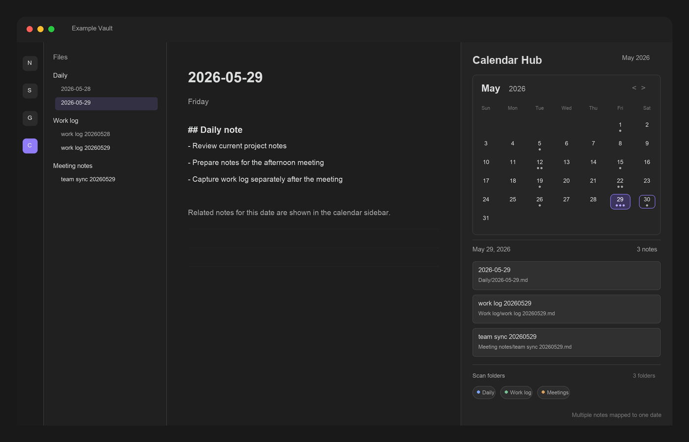

# Calendar Hub

> One calendar, **every** note from that day — no matter which folder it lives in.

Most calendar plugins map **one note per day**. Calendar Hub doesn't: click a date and it
surfaces **every note dated to that day** — by the date in its filename or frontmatter —
wherever it lives in your vault, so you can find, open, and manage them all from a single sidebar.



## Why Calendar Hub?

If you generate a lot of notes — daily logs, meeting notes, AI-generated summaries — they
scatter across folders and get hard to track down. A normal calendar only knows about your one
configured Daily Note, so everything else stays invisible.

Calendar Hub groups notes by the day they belong to, so a single date can surface many notes at
once:

- `Daily/2026-05-29.md`
- `Work log/work log 20260529.md`
- `Meeting notes/team sync 20260529.md`

Click the day, see all three.

## Calendar Hub vs. the original Calendar

Calendar Hub is a fork of Liam Cain's Calendar, so everything you expect still works — the
monthly view, daily and weekly notes, note-count dots, and "reveal active note." It adds what
Calendar was missing:

| | Calendar | Calendar Hub |
|---|---|---|
| Notes per day | One configured Daily Note | **Every matching note, in any folder** |
| Folder scope | Daily Notes folder only | **Whole vault, or just the folders you pick** |
| Date detection | Daily Notes filename | Filename + **extra formats** + **frontmatter fallback** |
| Weekly notes · dots · theming | ✓ | ✓ |

It uses its own plugin id (`calendar-hub`), so you can run it alongside Calendar and switch only
once you are happy.

## Features

- See all notes dated to any selected day (by filename or frontmatter), regardless of folder.
- Open and manage the day's notes from one panel.
- Scan the whole vault or limit matching to specific folders.
- Adjust folder filters directly from the calendar sidebar.
- Match exact Daily Notes filenames and dates embedded inside longer filenames.
- Add extra filename date formats such as `YYYYMMDD`.
- Use frontmatter date fields as a fallback when the filename has no date.
- Use note-count dots to see how many matching notes exist on each day.
- Keep optional weekly-note support for existing Calendar workflows.

## Date Matching

Calendar Hub maps Markdown files to calendar dates in this order:

1. Exact Daily Notes filename match using your configured Daily Notes format.
2. Date embedded in the filename using the Daily Notes format.
3. Date embedded in the filename using any extra formats you configure.
4. Frontmatter date fallback, only when the filename does not contain a matching date.

Filename dates take priority over frontmatter dates. Folder filters apply to both filename and frontmatter matching.

## Settings

- **Detect daily notes in all folders**: Scan Markdown files outside the configured Daily Notes folder.
- **Folders to scan for daily notes**: Limit matching to comma-separated folder paths. Leave blank to scan the whole vault.
- **Date format inside daily note filenames**: Add extra comma-separated formats, such as `YYYYMMDD`.
- **Use frontmatter date fallback**: Read configured frontmatter fields when the filename has no matching date.
- **Frontmatter date fields**: Choose fields such as `date`, `daily_date`, or `calendar.date`.
- **Note count dots**: Solid dots show how many matching notes exist for the day, up to 5 dots.
- **Confirm before creating new note**: Ask before creating a new Daily Note.
- **Show week number**: Show week numbers and keep legacy weekly-note behavior.

The folder filter can also be adjusted directly from the calendar sidebar.

## Installation

Calendar Hub is available in the Obsidian **Community Plugins** directory:

1. Open **Settings → Community plugins → Browse**.
2. Search for **Calendar Hub** and install it.
3. Enable it, then open the view from the ribbon icon or the **Open calendar view** command.

<details>
<summary>Manual or beta install</summary>

Install the latest commit with [BRAT](https://github.com/TfTHacker/obsidian42-brat) using the
repository `HWY1dot0/calendar-hub`, or download `main.js`, `manifest.json`, and `styles.css` from
a [release](https://github.com/HWY1dot0/calendar-hub/releases) and copy them into
`.obsidian/plugins/calendar-hub/` inside your vault, then reload Obsidian and enable the plugin.

</details>

## Commands

- **Open calendar view**: Opens the Calendar Hub sidebar view.
- **Reveal active note in calendar**: Moves the calendar to the month for the active date-based note.
- **Open weekly note**: Opens or creates the current weekly note when legacy weekly-note support is enabled.

## Compatibility

Calendar Hub requires Obsidian `0.9.11` or newer.

The plugin uses Obsidian theme variables and should follow light and dark themes without custom CSS.

## Relationship To Calendar

This plugin is based on Liam Cain's original Calendar plugin for Obsidian:

https://github.com/liamcain/obsidian-calendar-plugin

The original project is MIT licensed. The original copyright notice remains in `LICENSE`, alongside copyright for this fork's modifications.

Calendar Hub uses its own plugin id, `calendar-hub`, so it can be installed separately from the original Calendar plugin.

Two of Liam Cain's MIT-licensed libraries are vendored unmodified (published build artifacts) under `vendor/`, each with its license and provenance header: [obsidian-calendar-ui](https://github.com/liamcain/obsidian-calendar-ui) 0.3.12 and [obsidian-daily-notes-interface](https://github.com/liamcain/obsidian-daily-notes-interface) 0.9.0. Vendoring keeps the plugin free of runtime npm dependencies.

## Development

```bash
npm install
npm run build
```

## Say Thanks

If Calendar Hub helps your workflow, you can buy me a coffee:

https://www.buymeacoffee.com/hwy1dot0
